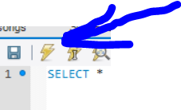

# BAMAZON!

## Overview

For this class assigned activity, I created an  Amazon-like storefront. The app takes in orders from customers and deplete stock from the store's inventory while tracking product sales across the store's departments and then summarizes of the highest-grossing departments in the store.

To run this program on your computer you will need to insure you install the required the MySQL and Inquirer npm packages in the directory that this is run in. The directory from github should take the node packages required using node and run accordingly. If not - please install the packages using npm install for inquirer and mySQL. 

## Starting the Program - 
* Use the command node cli.js AFTER loading all the files in the git repo. You should also pre-populate your SQL Workbench by inserting the "schema - by cutting and pasting into the program.  Start a new tab by using the Ctrl-T and paste the schema into the WOrkbench file followed by mouse click on the lightning bolt to insert. 

* Once the database is loaded with the pre data package the database is ready to use but you must be able to view your SQL Table using the Workbench - which you should update after running an update using the command (from the terminal "node cli.js").

## Instructions

### Notes

1. The Databasse is called  `bamazon_db`.

2. The table is called  `products`.

3. The products table has the following columns:

   * item_id (unique id for each product)

   * product_name (Name of product)

   * department_name

   * price (cost to customer)

   * stock_quantity (how much of the product is available in stores)

4. The database is populated with around 10 different mock products. (

5. Start the Node application called `bamazonCustomer.js`. Running this application will first display all of the items available for sale. 

6. The app will then prompt you with two messages.

   * The first will ask them the ID of the product they would like to buy.
   * The second message should ask how many units of the product you would like to buy.

7. Once you place the order, the app checks if the store has enough of the product to meet the your request.

   * If not, the app should will let you know.

8. However, if store has enough of the product, your order will be placed 
   * The SQL database will reflect the remaining quantity.
   * The app will then show the you the total cost of your purchase.

- - -

### Challenge #2: Manager View (Next Level)

* Create a new Node application called `bamazonManager.js`. Running this application will:

  * List a set of menu options:

    * View Products for Sale
    
    * View Low Inventory
    
    * Add to Inventory
    
    * Add New Product

  * If a manager selects `View Products for Sale`, the app should list every available item: the item IDs, names, prices, and quantities.

  * If a manager selects `View Low Inventory`, then it should list all items with an inventory count lower than five.

  * If a manager selects `Add to Inventory`, your app should display a prompt that will let the manager "add more" of any item currently in the store.

  * If a manager selects `Add New Product`, it should allow the manager to add a completely new product to the store.

- - -

* If you finished Challenge #2 and put in all the hours you were willing to spend on this activity, then rest easy! Otherwise continue to the next and final challenge.

- - -

### Challenge #3: Supervisor View (Final Level)

1. Create a new MySQL table called `departments`. Your table should include the following columns:

   * department_id

   * department_name

   * over_head_costs (A dummy number you set for each department)

2. Modify the products table so that there's a product_sales column and modify the `bamazonCustomer.js` app so that this value is updated with each individual products total revenue from each sale.

3. Modify your `bamazonCustomer.js` app so that when a customer purchases anything from the store, the price of the product multiplied by the quantity purchased is added to the product's product_sales column.

   * Make sure your app still updates the inventory listed in the `products` column.

4. Create another Node app called `bamazonSupervisor.js`. Running this application will list a set of menu options:

   * View Product Sales by Department
   
   * Create New Department

5. When a supervisor selects `View Product Sales by Department`, the app should display a summarized table in their terminal/bash window. Use the table below as a guide.

| department_id | department_name | over_head_costs | product_sales | total_profit |
| ------------- | --------------- | --------------- | ------------- | ------------ |
| 01            | Electronics     | 10000           | 20000         | 10000        |
| 02            | Clothing        | 60000           | 100000        | 40000        |

6. The `total_profit` column should be calculated on the fly using the difference between `over_head_costs` and `product_sales`. `total_profit` should not be stored in any database. You should use a custom alias.

7. If you can't get the table to display properly after a few hours, then feel free to go back and just add `total_profit` to the `departments` table.

   * Hint: You may need to look into aliases in MySQL.

   * Hint: You may need to look into GROUP BYs.

   * Hint: You may need to look into JOINS.

   * **HINT**: There may be an NPM package that can log the table to the console. What's is it? Good question :)

- - -

